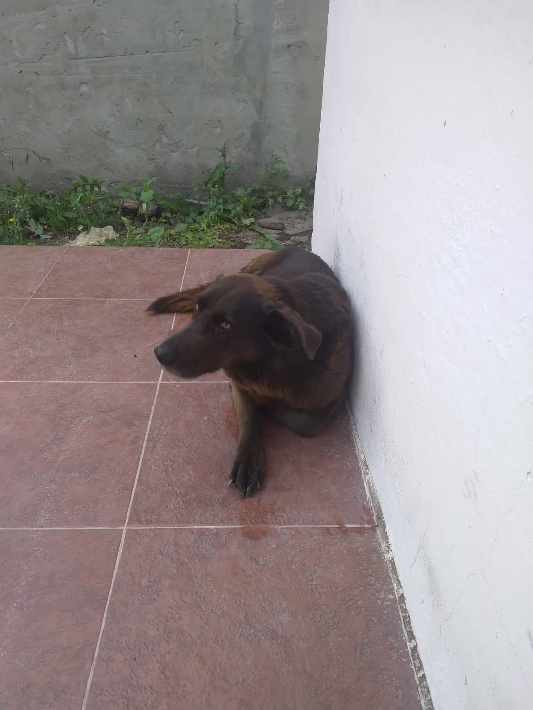

# Presentación

Hola a todos, me llamo José Becerra, tengo 21 años y soy de Marcos Paz.
Ingrese a la carrera en 2021 y actualmente me encuentro cursando materias de 1ro y 2do.

 Sobre mi:

- Me gusta mucho programar, y por eso, le tengo entusiasmo a esta materia, y al trabajo practico de la misma.
- Me gusta el desarrollo web y me vengo capacitando en algunas tecnologias desde 2022. 
- Me gusta el basquet, no lo juego pero sigo la NBA.
- Mi serie favorita es The Office
- Tengo 3 perros: Bart, Iris y Hanna. 

Adjunto foto de Bart:
